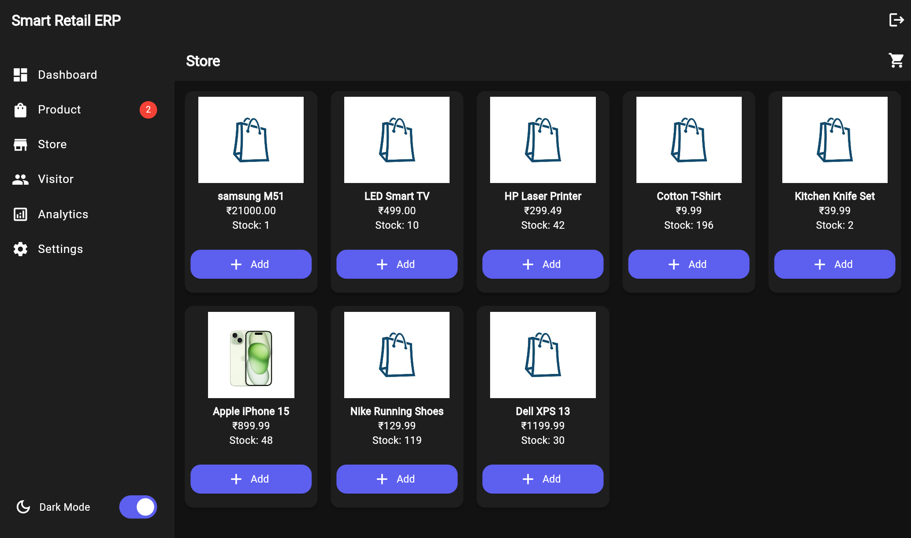

# 🛍️ Smart Retail ERP

A modern ERP system built using **Flutter**, **Supabase**, and **Riverpod** for managing product inventory, billing, and sales with real-time dashboard insights — styled like an Amazon store interface.

---

## 🚀 Features

- 📦 **Product Management** – Add, view, update products with stock tracking and low-stock alerts
- 🛒 **Store Page** – Scroll through products, add to cart, inspect and generate bills
- 🧾 **Billing System** – Stores purchase history with bill ID and quantity details
- 📊 **Dashboard Analytics** – View metrics like total products, stock, sales, and bills
- 🌙 **Dark Mode** – Toggle between light/dark themes with Riverpod support
- 🔁 **Real-Time Sync** – Pull-to-refresh updates using Supabase + Riverpod

---

## 🛠️ Tech Stack

| Layer         | Technology           |
|---------------|----------------------|
| UI            | Flutter              |
| Backend       | Supabase (PostgreSQL)|
| State Mgmt    | Riverpod             |
| Auth          | Supabase Auth        |
| Date Format   | `intl` package       |

---

## 📁 Project Structure
-lib/
-├── app/
-│ └── theme/ # Light and dark themes
-├── core/
-│ └── widgets/ # Reusable components (sidebar, buttons, etc.)
-├── data/
-│ ├── models/ # Product, CartItem, Bill models
-│ └── repositories/ # Supabase DB logic
-├── features/
-│ ├── auth/ # Login/Register UI
-│ ├── dashboard/ # Dashboard page + controller
-│ ├── product/ # Product listing, add/edit logic
-│ └── store/ # Store cart, billing, checkout logic

---

## 📊 Supabase Tables

### `products`
- `id`, `name`, `price`, `stock`, `created_at`

### `bills`
- `bill_id`, `total`, `date`

### `purchase_history`
- `id`, `bill_id` (FK), `product_id` (FK), `quantity`, `price`, `total`, `date`

---

## 📸 UI Previews

### 🔐 Authentication

| Login Page | Register Page | Dark Mode |
|------------|---------------|-----------|
|  |  |  |

---

### 📦 Product Management

| Product List (Mobile) | Inventory Page (Mobile) | Product List (Web) | Inventory (Web) |
|------------------------|--------------------------|---------------------|------------------|
|  |  |  |  |

---

### 📊 Dashboard

| Mobile Dashboard | Web Dashboard |
|------------------|----------------|
|  |  |

---

## 🧠 Future Enhancements

- 🧾 Export printable bills as PDF
- 🛂 Role-based access (Admin vs Staff)
- 📈 Charts with filters (monthly/yearly)
- 🔌 Offline cart support

---

